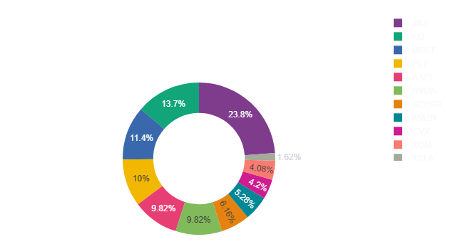
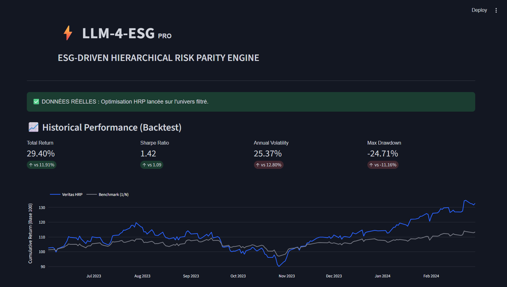
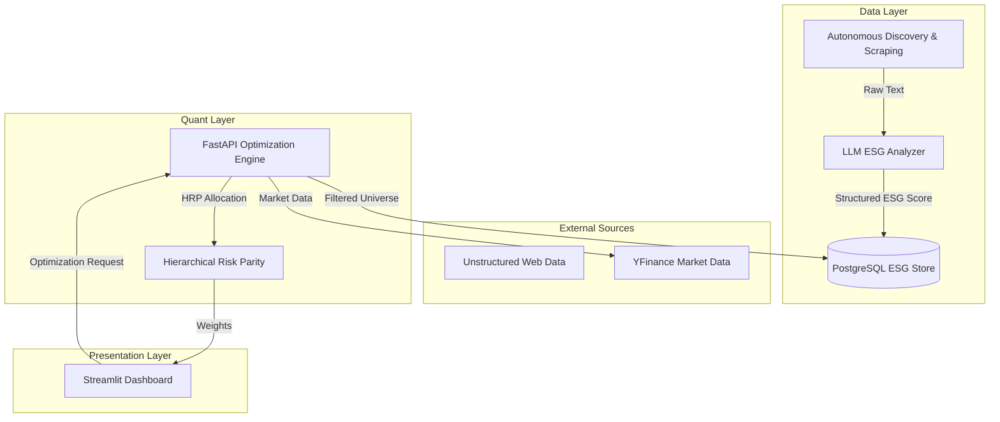

# **LLM-4-ESG-in-AM / AI-Driven ESG & HRP Allocation Engine**

*A next-generation autonomous quant engine fusing Generative AI, ESG intelligence, and Hierarchical Risk Parity optimization.*

---
<p align="center">
  
</p>
<p align="center">
  
</p>
---


## **Executive Summary**

LLM-4-ESG-in-AM automates the full ESG-aware investment workflow, delivering explainable, data-driven and mathematically robust portfolio allocation.

It addresses three major challenges in modern asset management:

### **1. Autonomous ESG Intelligence (LLM-Driven)**
- Agent-based discovery of sustainability reports  
- Local or cloud inference (Llama 3 / GPT)  
- JSON-schema-enforced scoring for governance  
- PostgreSQL persistence for auditability  

### **2. Robust Portfolio Construction (Hierarchical Risk Parity)**
- Graph-theoretic diversification  
- Ward clustering + quasi-diagonalization  
- Recursive bisection allocation  
- No covariance inversion (stable in high correlation regimes)  

### **3. Fully Automated Front-to-Back Pipeline**
- Web scraping → LLM analysis → Database → HRP optimization  
- Full reproducibility  
- Production-ready modular monolith  

---

## **Interactive Dashboard (UI)**

LLM-4-ESG-in-AM includes a professional TradingView-style **Streamlit interface** for visualization and analysis of ESG scores and HRP weights.

### **Key Capabilities**
- Asset universe configuration  
- ESG thresholding and AI audit trail  
- HRP weight visualization  
- Asset inclusion/exclusion overview  
- Market data retrieval  
- End-to-end pipeline monitoring  

### **Run the UI**
```bash
python -m streamlit run app.py
```

Accessible at:
```
http://localhost:8501
```

---

## **Architectural Overview**

LLM-4-ESG-in-AM adopts a **Modular Monolith** architecture, ensuring scalability, maintainability, and operational transparency.

```
Collector (Scraper + LLM)
│
├── Engine (HRP + Market Data + API)
│
└── Presentation (Streamlit Dashboard)
```

### **Why This Architecture?**
- LLM inference and ESG logic are **fully decoupled** from quantitative models  
- HRP allocation remains **deterministic and audit-ready**  
- Infrastructure (LLM provider, API, deployment) can evolve independently  
- All ESG decisions are **versioned and stored** in PostgreSQL  

---

## **System Diagram (Mermaid)**



---

# **Quantitative Framework (Mathematics)**

LLM-4-ESG-in-AM implements the **Hierarchical Risk Parity (HRP)** methodology by López de Prado.

---

## **1. Distance Metric Construction**

Distance derived from correlation:

$$
d_{i,j} = \sqrt{0.5(1 - \rho_{i,j})}
$$

---

## **2. Ward Hierarchical Clustering**

Groups assets by minimizing intra-cluster variance.

---

## **3. Quasi-Diagonalization**

Reorders the covariance matrix to reflect the hierarchical cluster structure.

---

## **4. Recursive Bisection Allocation**

Capital allocation follows:

$$
\alpha = 1 - \frac{Var_{left}}{Var_{left} + Var_{right}}
$$

---

# **Intelligence Layer (LLM ESG Engine)**

### **Autonomous Workflow**
1. Web discovery via DuckDuckGo queries  
2. Text extraction and filtering  
3. LLM scoring with strict JSON schema  
4. ESG persistence into PostgreSQL  

### **Inference Modes**
- Local LLM (Llama 3 via Ollama)  
- Cloud inference (OpenAI GPT models)

---

# **Installation & Usage**

## **Prerequisites**
- Python 3.11+  
- Docker Desktop  
- (Optional) Ollama  

---

## **1. Clone repository**
```bash
git clone https://github.com/YOUR_USERNAME/LLM-4-ESG-in-AM.git
cd LLM-4-ESG-in-AM
```

---

## **2. Install dependencies**
```bash
poetry install
```

---

## **3. Start Infrastructure**
```bash
docker compose up --build -d
```

---

## **4. Run ESG ingestion pipeline**
```bash
make pipeline
```

---

## **5. Launch API**
```bash
make api
```

API Docs:
```
http://127.0.0.1:8000/docs
```

---

## **6. Launch Dashboard**
```bash
make ui
```

Dashboard:
```
http://localhost:8501
```

---

# **Project Structure**

```
src/
├── collector/            # ESG Data Acquisition Layer
│   ├── scraper.py        # Autonomous Web Scraping
│   ├── llm_analyzer.py   # LLM ESG Engine
│   └── loader.py         # Market Data Loader
│
├── engine/               # Quantitative Core
│   ├── hrp_optimizer.py  # HRP Algorithm
│   ├── db_manager.py     # PostgreSQL ORM
│   ├── api_server.py     # FastAPI Layer
│   └── utils.py          # Log Returns & Risk Tools
│
├── app.py                # Streamlit Dashboard
├── scripts/
│   └── run_esg_pipeline.py
```

---

# **Continuous Integration**

- Ruff for linting  
- MyPy for typing validation  
- Pytest for mathematical and functional testing  

---

# **License**

Distributed under the MIT License.

---